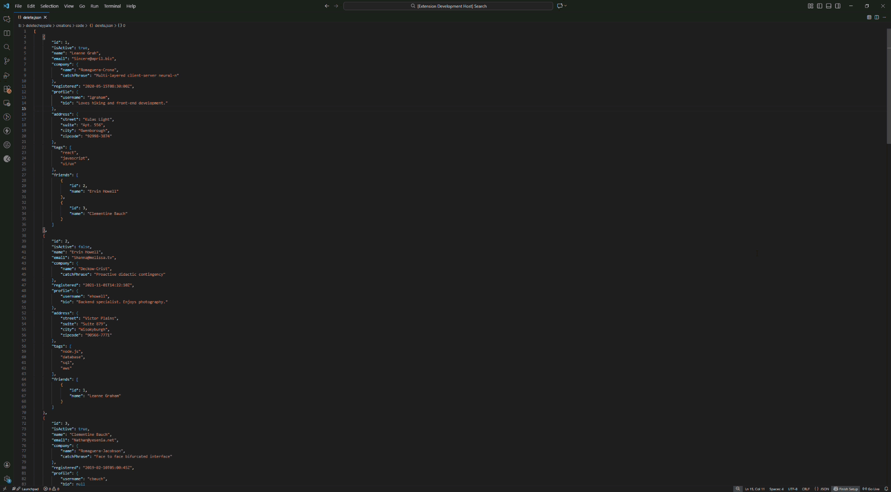

# Smart JSON Viewer for VS Code

Stop squinting at raw, minified JSON. This extension transforms your `.json` files into interactive **Tables** and **Trees**, complete with two way editing, filtering, and powerful export tools.

## Why?

Working with large JSON files—like API responses or data dumps—is often painful. It is hard to read, difficult to compare items, and risky to edit manually. 

This tool provides a clean, spreadsheetlike interface (and now a structured Tree view) to make visualizing and manipulating data simple, all without leaving VS Code.

## Key Features

### 1. Dual View Modes
Switch instantly between two powerful visualizations using the toggle at the top right:
* **Table View:** A spreadsheet style view perfect for arrays of objects. Sort, filter, and compare data side by side.
* **Tree View:** A hierarchical view perfect for understanding deep nesting and complex structures.

### 2. Universal Two Way Editing
This is the killer feature. You can edit data directly in the preview, and your source `.json` file updates instantly.
* **In Table Mode:** Double click any cell to edit.
* **In Tree Mode:** Double click any primitive value (strings, numbers, booleans) to edit.
* **Sync:** Changes made in the text editor also sync back to the preview automatically.

### 3. Deep Navigation
* **Drill Down:** In Table view, clicking on an `[Object]` or `[Array]` cell opens that specific item in a focused table view.
* **Breadcrumbs:** Navigate back up through your data hierarchy with a single click.

### 4. Powerful Analysis (Table Mode)
* **Find in View:** Press `Ctrl+F` or click the Search icon to search the entire table (including headers). Matches are highlighted with navigation controls.
* **Sort & Filter:** Click headers to sort (A-Z, 1-9) or use the filter row to find specific values.
* **Column Control:** Hide noisy data by toggling specific columns, or use the master "ALL" checkbox to reset the view.

### 5. Smart Export Tools
* **Export to CSV:** Instantly export your current filtered/sorted table view to a `.csv` file.
* **Smart Export to XLSX:** Generates a relational, multisheet Excel file. Instead of flattening data into a mess, nested objects (like `address`) and arrays (like `tags`) are automatically moved to their own sheets and linked via a `_rowId`.

## How to Use

1.  Open any `.json` or `.jsonc` file in VS Code.
2.  Click the **Preview JSON** icon (curly braces `{}`) in the editor's title bar.
3.  Use the **Table / Tree** toggle in the top right to switch views.

## Feedback & Contributing

Find a bug? Have a feature request? Feel free to [open an issue](https://github.com/shyam-lal/json-table-viewer/issues) on the GitHub repo.

## License

[MIT](https://opensource.org/licenses/MIT)